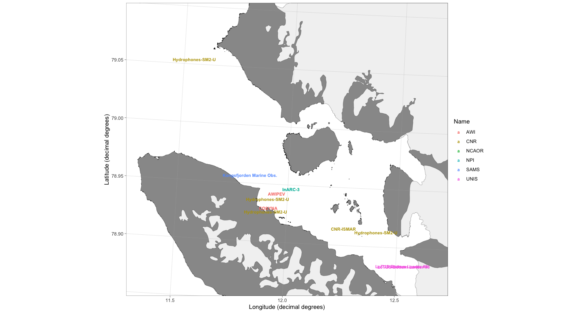
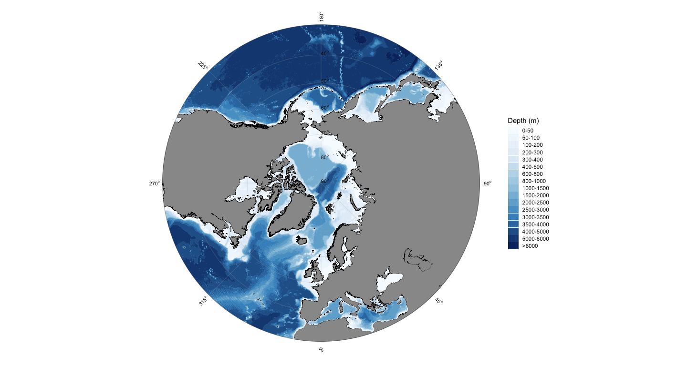
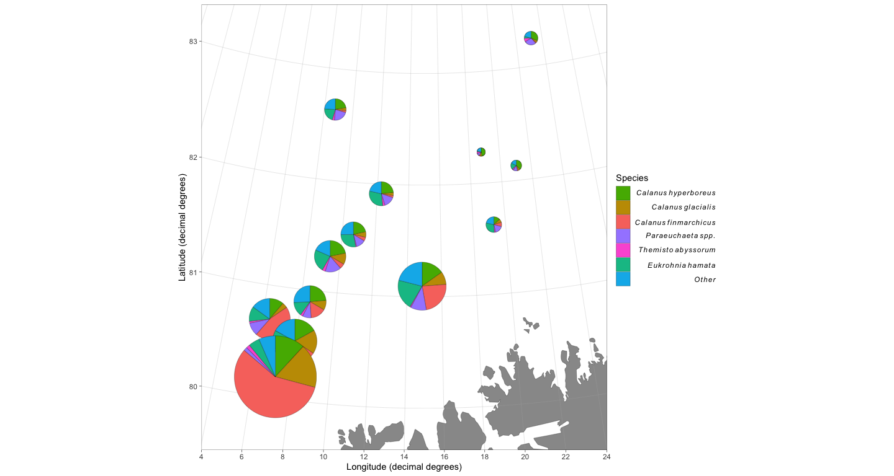

PlotSvalbard
======
**Plot research data from Svalbard on maps. R package version 0.8.2.**

This is a developmental version of the **PlotSvalbard** package providing functions to plot research data from Svalbard on detailed and up-to-date maps that are not available in online databases. The package is developed by the Norwegian Polar Institute. Glacier fronts and land shapes of Kongsfjorden originate from July 2017.

As the package is in an early developmental phase, functions might not work as intended. Note that the package comes with absolutely no warranty and that maps generated by the package might be wrong. Any bug reports and code fixes are warmly welcomed. See *Contributions and contact information* for further details.

**PlotSvalbard** is based on [**ggplot2**](http://ggplot2.tidyverse.org/reference/) and the functions can be expanded using ggplot syntax.

Installation of the GitHub version
-------
Using the [**devtools**](https://cran.r-project.org/web/packages/devtools/index.html) package:


```r
devtools::install_github("MikkoVihtakari/PlotSvalbard", dependencies = TRUE)
```

Usage
-------
**PlotSvalbard** extends on [**ggplot2**](http://ggplot2.tidyverse.org/reference/). Data that contains geographic information can be plotted on these maps using the ggplot2 layers separated by the `+` operator.

### Website

PlotSvalbard has a [website](https://mikkovihtakari.github.io/PlotSvalbard/index.html), which is updated together with each major release.

### Function reference

[An organized list of functions](https://mikkovihtakari.github.io/PlotSvalbard/reference/index.html) included in the package can be found from the website.

### User manual

Detailed information on how to use the package can be found from [the user manual](https://mikkovihtakari.github.io/PlotSvalbard/articles/PlotSvalbard_user_manual.html) 

### Making a map with text


```r
library(PlotSvalbard)

data("kongsfjord_moorings")

basemap("kongsfjorden", limits = c(11.3, 12.69, 78.86, 79.1), round.lat = 0.05, round.lon = 0.5) + 
geom_text(data = kongsfjord_moorings,
  aes(x = lon.utm, y = lat.utm, label = Mooring.name, color = Name), 
  fontface = 2, size = 25.4/72.27*8) # font size = 8, see Graphical parameters
```

<!-- -->

### Barents Sea ocean-current arrows


```r
basemap("barentssea", bathymetry = TRUE, currents = TRUE, current.size = "scaled")
```

<!-- -->

### Pan-Arctic maps


```r
basemap("panarctic", bathymetry = TRUE)
```

<!-- -->

### Combining extensions for ggplot2

Most extensions for ggplot2 work together with PlotSvalbard.


```r
data(zooplankton)

x <- transform_coord(zooplankton, lon = "Longitude", lat = "Latitude", bind = TRUE)

species <- colnames(x)[!colnames(x) %in% c("lon.utm", "lat.utm", "ID", "Longitude", "Latitude", "Total")]

library(scatterpie)

basemap("barentssea", limits = c(4, 24, 79.5, 83.5), round.lon = 2, round.lat = 1) +
geom_scatterpie(aes(x = lon.utm, y = lat.utm, group = ID, r = 100*Total), data = x, cols = species, size = 0.1) +
scale_fill_discrete(name = "Species", breaks = species, 
labels = parse(text = paste0("italic(" , sub("*\\.", "~", species), ")")))
```

<!-- -->

Data sources and citations
-------

If you use the package to make maps for your publications, please cite it. For up-to-date citation information, please use:


```r
citation("PlotSvalbard")
```

```
## 
## To cite package 'PlotSvalbard' in publications use:
## 
##   Mikko Vihtakari (2019). PlotSvalbard: PlotSvalbard - Plot
##   research data from Svalbard on maps. R package version 0.8.2.
##   https://github.com/MikkoVihtakari/PlotSvalbard
## 
## A BibTeX entry for LaTeX users is
## 
##   @Manual{,
##     title = {PlotSvalbard: PlotSvalbard - Plot research data from Svalbard on maps},
##     author = {Mikko Vihtakari},
##     year = {2019},
##     note = {R package version 0.8.2},
##     url = {https://github.com/MikkoVihtakari/PlotSvalbard},
##   }
```

The maps generated by this package should be cited to their original source. 

- Svalbard maps originate from the [Norwegian Polar Institute](http://geodata.npolar.no/). Distributed under the [CC BY 4.0 license](https://creativecommons.org/licenses/by/4.0/) ([terms of use](http://geodata.npolar.no/bruksvilkar/)).
- Barents Sea and pan-Arctic land shapes are downloaded from [Natural Earth Data](http://www.naturalearthdata.com). They use the [ne_10m_land](http://www.naturalearthdata.com/downloads/10m-physical-vectors/) and [ne_50m_land](http://www.naturalearthdata.com/downloads/50m-physical-vectors/) (v 4.0.0) datasets, respectively. Distributed under the [CC Public Domain license](https://creativecommons.org/publicdomain/) ([terms of use](http://www.naturalearthdata.com/about/terms-of-use/)).
- Pan-Arctic bathymetry shapefile is generalized from [General Bathymetric Chart of the Oceans One Minute Grid](https://www.gebco.net/data_and_products/gridded_bathymetry_data/gebco_one_minute_grid/).
- Barents Sea bathymetry shapefile is generalized from [IBCAO v3.0 500m RR grid](https://www.ngdc.noaa.gov/mgg/bathymetry/arctic/ibcaoversion3.html). Should be cited as [Jakobsson, M., et al. The International Bathymetric Chart of the Arctic Ocean (IBCAO) Version 3.0. Geophys. Res. Lett. 2012, 39:L12609.](https://www.ngdc.noaa.gov/mgg/bathymetry/arctic/2012GL052219.pdf)
- Svalbard fjord bathymetry shapefiles are from the [Norwegian Mapping Authority](https://kartkatalog.geonorge.no/metadata/kartverket/dybdedata/2751aacf-5472-4850-a208-3532a51c529a). Distributed under the [CC BY 4.0 license](https://creativecommons.org/licenses/by/4.0/).

The example data included in the package are property of the Norwegian Polar Institute and should not be used in other instances. I.e. these data are unpublihed at the moment.

Contributions and contact information
-------
Any contributions to the package are more than welcome. Please contact the package creator Mikko Vihtakari (<mikko.vihtakari@gmail.com>) to discuss your ideas on improving the package.

News
--------
2019-02-11 Updated to v0.8. PlotSvalbard can now make maps of any region north of 30 degrees latitude. **REMOVED arctic50 and arctic60** map types and replaced these by basemap("panarctic", limits = 50) (or any integer between 30 and 88). Automatic limits should now work for all map types. 

2018-12-18 Updated to v0.7. Added interpolation for oceanographic section plots together with a function that produces such plots using ggplot2. Renamed the previous `interpolate` function, which performed spatial interpolation to `interpolate_spatial`. Added possibility to adjust legend positions to `basemap`. Improved Barents Sea current arrow plotting. The new functions are still relatively unstabile and introduce more dependancies. Please report if you do not manage to install the new version of PlotSvalbard. The situation will be improved in the future updates.

2018-11-07 Updated to the next major version v0.6. Added temperature - salinity plot functions from the MarineDatabase package. These functions are still under development. Updated online documentation, streamlined shape files (they take less space now, but Kongsfjorden maps take a couple of second longer to generate), and fixed a bug that caused `basemap` function to crash if there was no land within the limits (thanks for noticing it Allison!). 

2018-10-26 Updated to next major version v0.5. Added ocean currents for Barents Sea as well as (rudimentary) waffle charts. Made the arguments for basemap more logical. *This update will break the maps made using previous versions of the package*. Change the argument names inside basemap, and it should work as before.

2018-09-21 Updated to v0.4 with many new features, such as improved bathymetry and automatic map limits. See [the user manual](https://mikkovihtakari.github.io/PlotSvalbard/articles/PlotSvalbard_user_manual.html) for details. 
